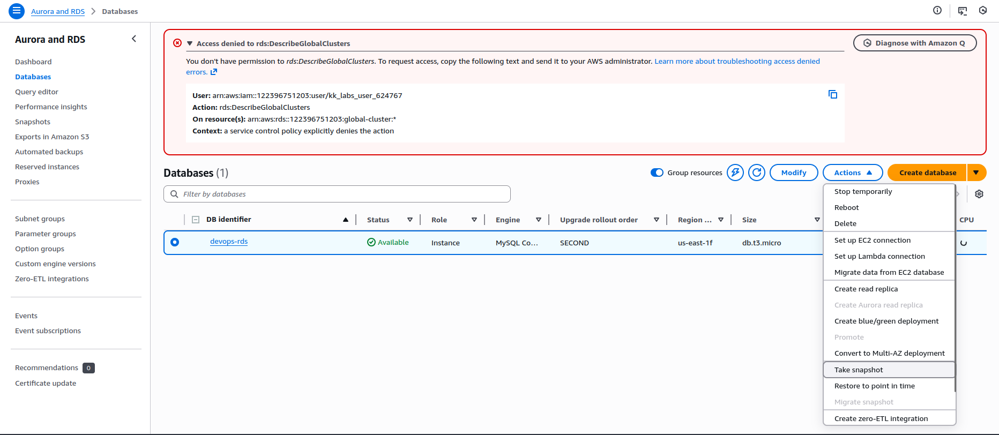
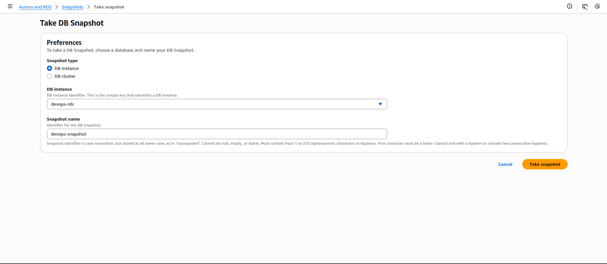
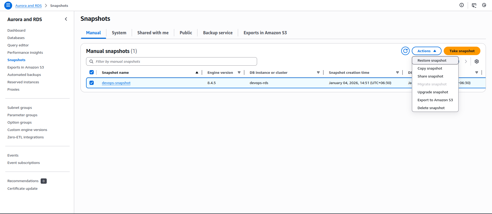
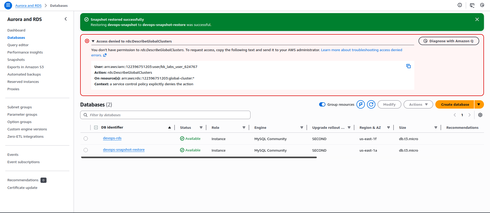

🔹 Step 1: Ensure Source RDS is Available

Open AWS Console → RDS

Click Databases

Confirm devops-rds status is Available

⚠️ If it’s not Available, wait before proceeding.

🔹 Step 2: Create RDS Snapshot

Select devops-rds

Click Actions → Take snapshot

Enter:

Snapshot name: devops-snapshot

Click Take snapshot

Wait:

Go to Snapshots

Ensure devops-snapshot status becomes Available

🔹 Step 3: Restore Snapshot to New RDS Instance

Go to Snapshots

Select devops-snapshot

Click Actions → Restore snapshot

🔹 Step 4: Configure Restored RDS Instance

On the restore page:

DB instance settings

DB instance identifier:

devops-snapshot-restore

Instance configuration

DB instance class:

db.t3.micro

Connectivity

Public access:
❌ No (keep private)

Other settings

Leave all other options as default

Click Restore DB instance

🔹 Step 5: Wait for Completion

Go back to Databases

Select devops-snapshot-restore

Wait until Status = Available

⏳ This may take several minutes.

---