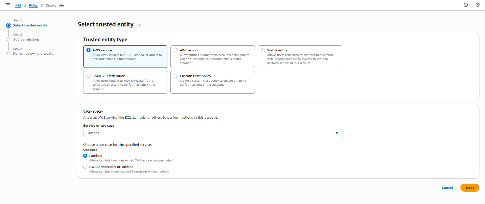
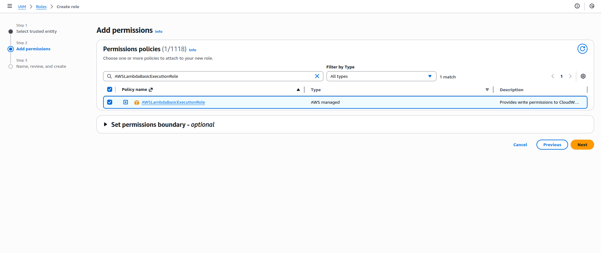
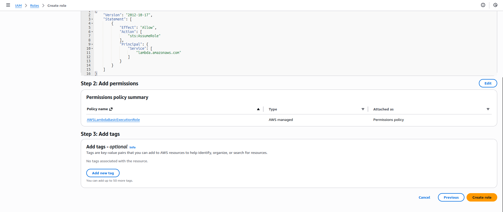
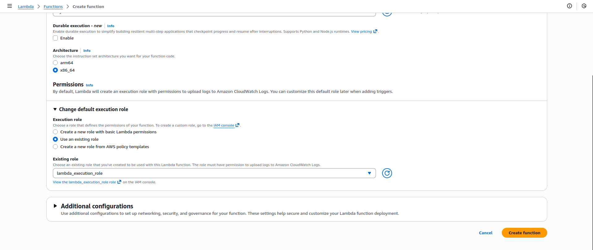
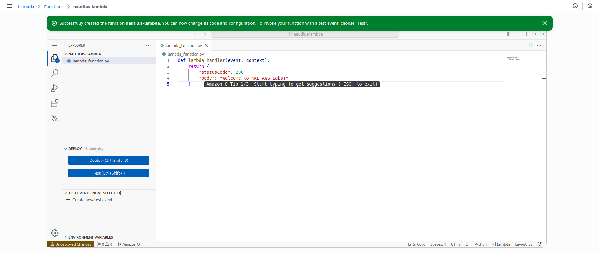
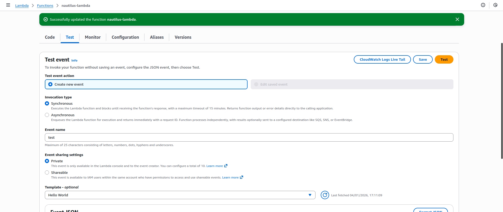
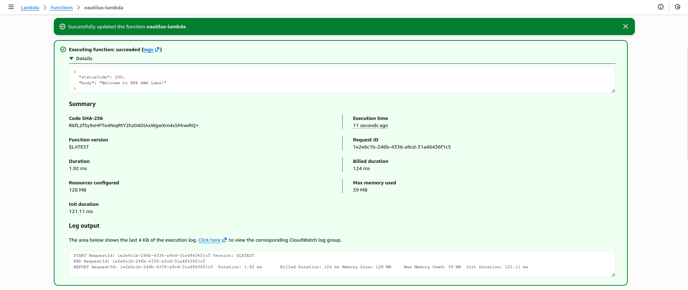

<!-- NAV_START -->
[⬅️ Back to Main README](../README.md) | [◀️ Previous Day](../Day%2032.%20Snapshot%20and%20Restoration%20of%20an%20RDS%20Instance) | [Next Day ▶️](../Day%2034.%20Create%20a%20Lambda%20Function%20Using%20CLI)
<!-- NAV_END -->

🔹 Step 1: Create the IAM Role (lambda_execution_role)

Go to AWS Console → IAM

Click Roles → Create role

Trusted entity type:

Select AWS service

Use case:

Choose Lambda

Click Next

Permissions

Attach policy:

✅ AWSLambdaBasicExecutionRole

Click Next

Role name

Role name:

lambda_execution_role

Click Create role

✅ IAM role is ready.

🔹 Step 2: Create the Lambda Function

Go to AWS Console → Lambda

Click Create function

Choose Author from scratch

Basic information

Function name:

nautilus-lambda

Runtime:

Python (Python 3.x – any available version is fine)

Permissions

Under Change default execution role

Select Use an existing role

Choose:

lambda_execution_role

Click Create function

🔹 Step 3: Add the Lambda Function Code

In the Code tab, replace the default code with this:

def lambda_handler(event, context):
    return {
        "statusCode": 200,
        "body": "Welcome to KKE AWS Labs!"
    }

Click Deploy

🔹 Step 4: Test the Lambda Function

Click Test

Create a new test event:

Event name: test

Keep default JSON

Click Test

✅ Expected Output

You should see:

{
  "statusCode": 200,
  "body": "Welcome to KKE AWS Labs!"
}

---

<!-- NAV_START -->
[⬅️ Back to Main README](../README.md) | [◀️ Previous Day](../Day%2032.%20Snapshot%20and%20Restoration%20of%20an%20RDS%20Instance) | [Next Day ▶️](../Day%2034.%20Create%20a%20Lambda%20Function%20Using%20CLI)
<!-- NAV_END -->
