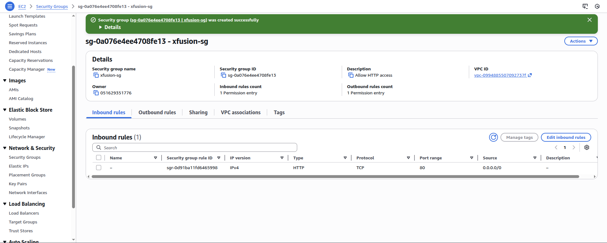
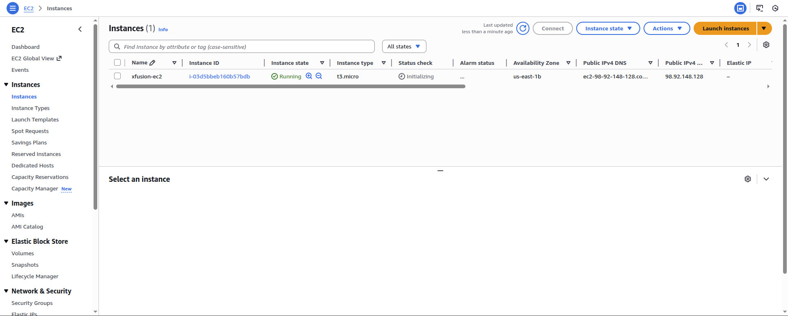
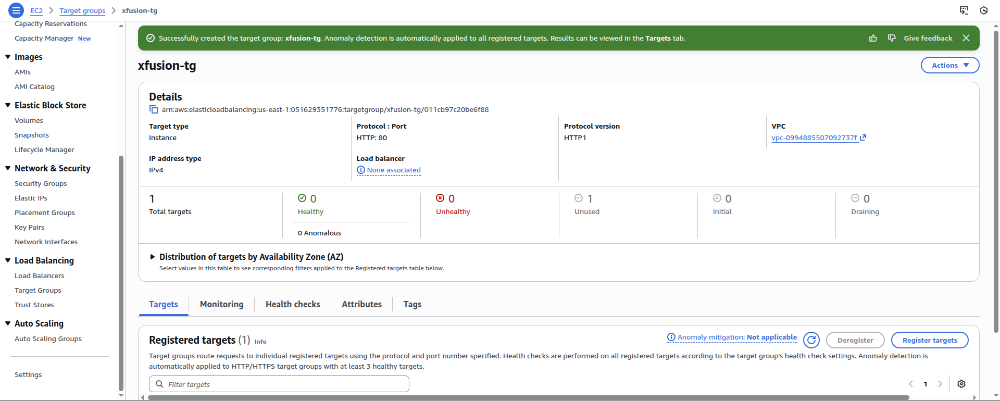
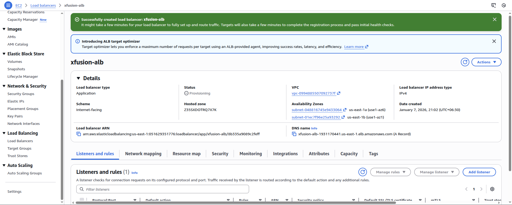

Step 1: Create Security Group xfusion-sg

Open AWS Management Console

Go to EC2 → Security Groups

Click Create security group

Configuration

Security group name: xfusion-sg

Description: Allow HTTP access

VPC: Default VPC

Inbound Rules

Add rule:

Type: HTTP

Protocol: TCP

Port: 80

Source: 0.0.0.0/0

Leave Outbound rules as default

Click Create security group

✅ This security group will be attached to the EC2 instance

Step 2: Create EC2 Instance xfusion-ec2

Go to EC2 → Instances → Launch instance

Basic Configuration

Name: xfusion-ec2

AMI: Ubuntu (any available version, e.g., Ubuntu 22.04)

Instance type: t2.micro (or any free-tier type)

Key pair: Choose existing or create new

Network: Default VPC

Subnet: Any public subnet

Auto-assign Public IP: Enable

Security Group

Select Existing security group

Choose xfusion-sg

User Data Script (IMPORTANT)

Paste the following under Advanced details → User data:

#!/bin/bash
apt update -y
apt install nginx -y
systemctl start nginx
systemctl enable nginx

This script installs and starts Nginx automatically at launch

Click Launch instance

Wait until instance status shows Running

Step 3: Create Target Group xfusion-tg

Go to EC2 → Target Groups

Click Create target group

Configuration

Target type: Instances

Target group name: xfusion-tg

Protocol: HTTP

Port: 80

VPC: Default VPC

Health check path: /

Click Next

Register Targets

Select xfusion-ec2

Click Include as pending

Click Create target group

Step 4: Create Application Load Balancer xfusion-alb

Go to EC2 → Load Balancers

Click Create load balancer

Select Application Load Balancer

Basic Configuration

Name: xfusion-alb

Scheme: Internet-facing

IP address type: IPv4

Network Mapping

VPC: Default VPC

Availability Zones: Select at least two subnets

Security Groups

Select default security group

Ensure it allows:

HTTP (80) from 0.0.0.0/0

Listener and Routing

Listener:

Protocol: HTTP

Port: 80

Default action:

Forward to xfusion-tg

Click Create load balancer

Step 5: Verify Security Group for ALB

Go to EC2 → Security Groups

Open the default security group attached to the ALB

Ensure Inbound rule exists:

HTTP | TCP | 80 | 0.0.0.0/0

If not:

Add it

Save rules

Step 6: Verify Target Health

Go to EC2 → Target Groups

Select xfusion-tg

Open Targets tab

Status should show:

Healthy

⏳ This may take 1–2 minutes after ALB creation

Step 7: Access the Application via ALB DNS

Go to EC2 → Load Balancers

Select xfusion-alb

Copy the DNS name

Open browser and paste:

http://<ALB-DNS-NAME>

✅ Expected Output

You should see the Nginx Welcome Page, confirming:

✔ EC2 instance is running
✔ Nginx is installed and active
✔ ALB is routing traffic correctly
✔ Target group is healthy

---