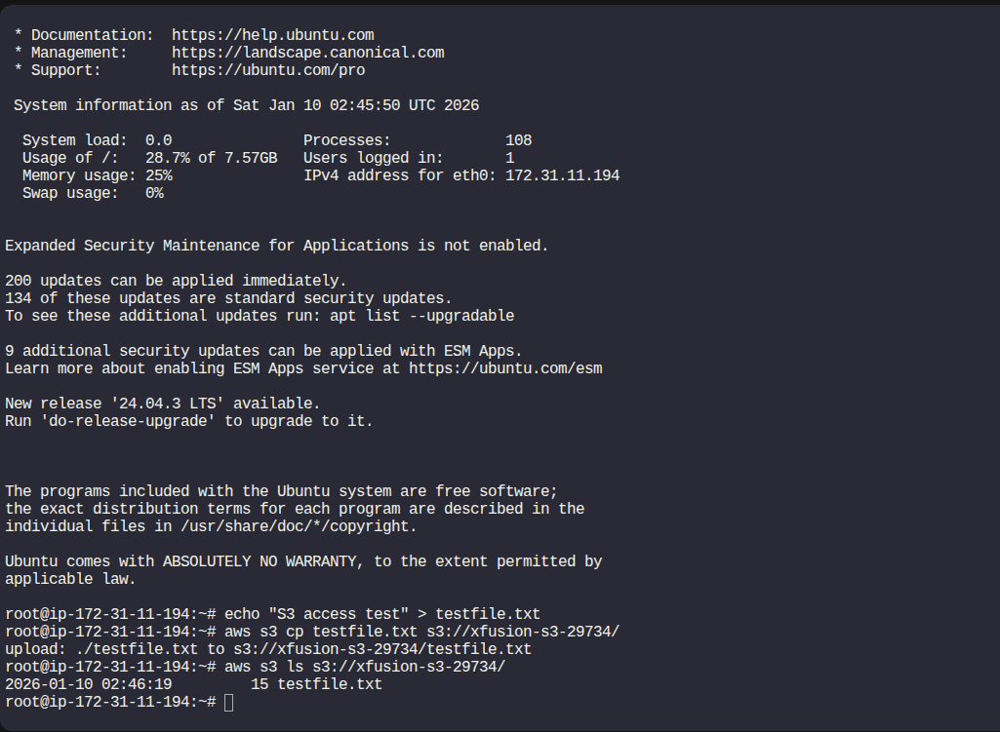

Step 1: Verify Existing EC2 Instance

An EC2 instance named xfusion-ec2 already exists.

No changes are needed yet.

This instance will later be attached to an IAM role for S3 access.

Step 2: Set Up SSH Keys (Password-less Access)
2.1 Create SSH Key Pair on aws-client

Connect to the aws-client host.

Generate a new SSH key pair:

ssh-keygen -t rsa -f /root/.ssh/id_rsa -N ""


Confirm files exist:

ls /root/.ssh/


You should see:

id_rsa  id_rsa.pub

2.2 Add Public Key to EC2 Instance

Connect to xfusion-ec2 using AWS Console (Instance Connect or Session Manager).

Allow SSH port from anywhere at EC2's Security Group

mkdir -p /root/.ssh
chmod 700 /root/.ssh


Edit authorized keys file:
sudo -i
vi /root/.ssh/authorized_keys


Paste contents of:

/root/.ssh/id_rsa.pub


Save and exit.


✅ Password-less SSH is now enabled.

Step 3: Create a Private S3 Bucket

Open AWS Console → S3

Click Create bucket

Configuration

Bucket name: xfusion-s3-29734

Region: Same as EC2

Object Ownership: ACLs disabled

Block Public Access: ✅ Keep all enabled (private bucket)

Click Create bucket

✅ Bucket is now private by default.

Step 4: Create IAM Policy for S3 Access
4.1 Create Policy

Go to IAM → Policies → Create policy

Choose JSON tab

Paste the following policy (replace region/account automatically handled):
```
{
  "Version": "2012-10-17",
  "Statement": [
    {
      "Effect": "Allow",
      "Action": [
        "s3:PutObject",
        "s3:GetObject"
      ],
      "Resource": "arn:aws:s3:::xfusion-s3-29734/*"
    },
    {
      "Effect": "Allow",
      "Action": "s3:ListBucket",
      "Resource": "arn:aws:s3:::xfusion-s3-29734"
    }
  ]
}
```

Click Next

Policy name:

xfusion-s3-policy


Click Create policy

Step 5: Create IAM Role and Attach Policy
5.1 Create Role

Go to IAM → Roles → Create role

Trusted entity:

AWS service

EC2

Click Next

5.2 Attach Policy

Select:

xfusion-s3-policy


Click Next

5.3 Role Name

Role name:

xfusion-role


Click Create role

Step 6: Attach IAM Role to EC2 Instance

Go to EC2 → Instances

Select xfusion-ec2

Click Actions → Security → Modify IAM role

Choose:

xfusion-role


Click Update IAM role

✅ EC2 now has permission to access S3.

Step 7: Test S3 Access from EC2
7.1 SSH into EC2 Instance

From aws-client:

ssh root@<xfusion-ec2-public-ip>

7.2 Create a Test File
echo "S3 access test" > testfile.txt

7.3 Upload File to S3
aws s3 cp testfile.txt s3://xfusion-s3-29734/


Expected output:

upload: ./testfile.txt to s3://xfusion-s3-29734/testfile.txt

7.4 List Files in the Bucket
aws s3 ls s3://xfusion-s3-29734/


Expected output:

testfile.txt



---