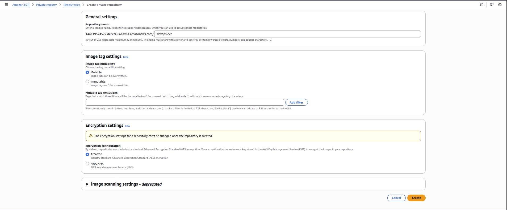
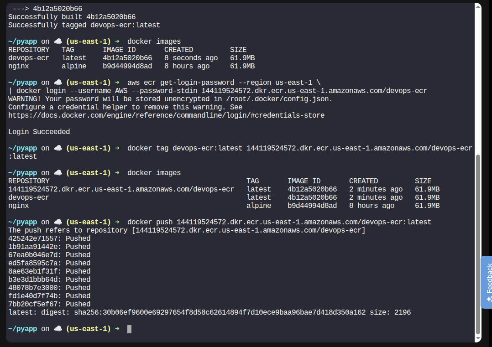
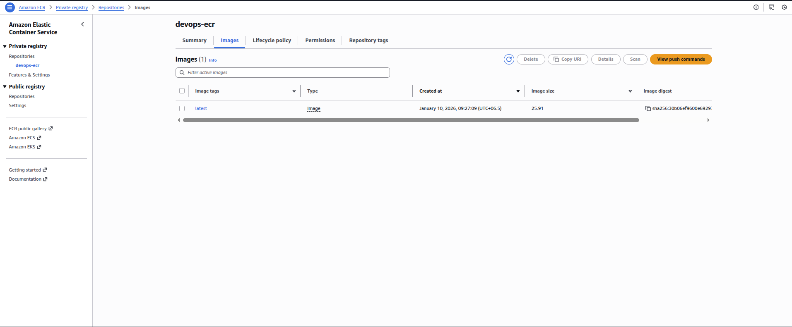
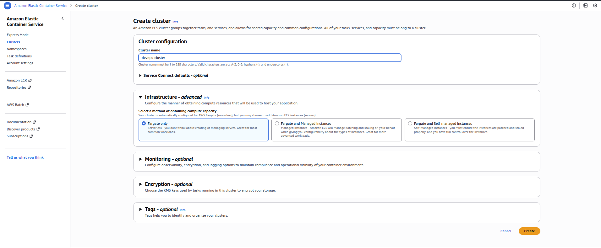
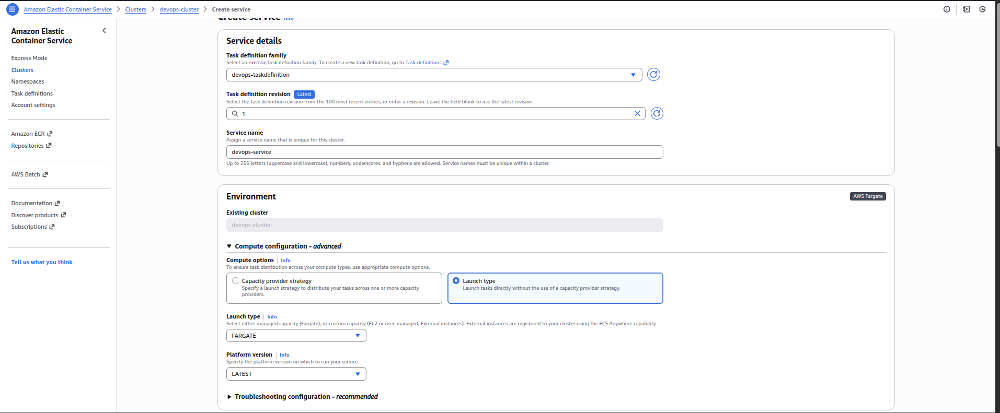
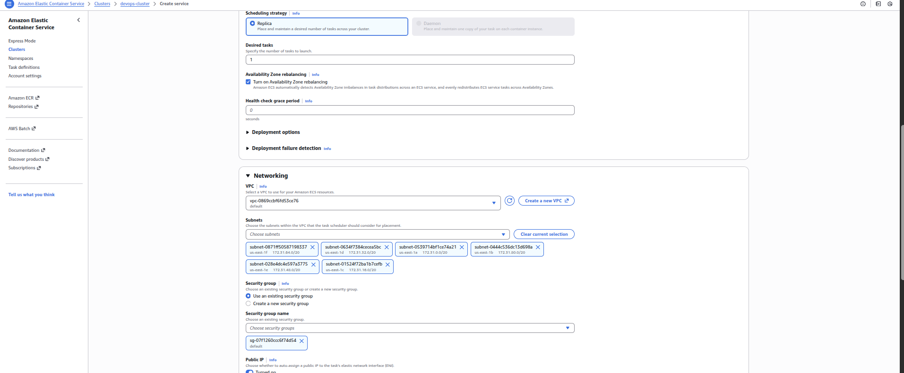
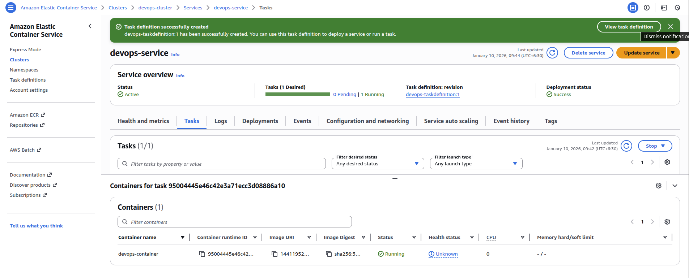

<!-- NAV_START -->
[⬅️ Back to Main README](../README.md) | [◀️ Previous Day](../Day%2037.%20Managing%20EC2%20Access%20with%20S3%20Role-based%20Permissions) | [Next Day ▶️](../Day%2039.%20Hosting%20a%20Static%20Website%20on%20AWS%20S3)
<!-- NAV_END -->

Step 1: Create a Private ECR Repository

Log in to the AWS Management Console

Navigate to Elastic Container Registry (ECR)

Click Create repository

Repository Settings

Visibility: Private

Repository name:

`devops-ecr`


Leave all other options as default

Click Create 



Copy the repository URI (you will need it later), for example:

xxxxxxxxxxxx.dkr.ecr.us-east-1.amazonaws.com/devops-ecr

Step 2: Build Docker Image on aws-client

Log in to the aws-client host.

Go to the Dockerfile directory:

```
cd /root/pyapp
# Build the Docker image:
docker build -t xxxxxxxxxxxx.dkr.ecr.us-east-1.amazonaws.com/devops-ecr .
# Verify the image:
docker images
```

Step 3: Authenticate Docker to ECR

Authenticate Docker with ECR:

```
aws ecr get-login-password --region us-east-1 \
| docker login --username AWS --password-stdin xxxxxxxxxxxx.dkr.ecr.us-east-1.amazonaws.com/devops-ecr
```

✅ Login should succeed without errors.

Step 4: Push Docker Image to ECR


Push the image:
```
docker push xxxxxxxxxxxx.dkr.ecr.us-east-1.amazonaws.com/devops-ecr
```

Verify in ECR → devops-ecr → Images

You should see the latest tag





Step 5: Create ECS Cluster (Fargate)

Go to ECS → Clusters

Click Create cluster

Cluster Configuration

Cluster name:

`devops-cluster`


Infrastructure: AWS Fargate

Click Create



Step 6: Create ECS Task Definition

Go to ECS → Task definitions

Click Create new task definition

Select Fargate

Click Next

Task Definition Settings

Task definition name:

`devops-taskdefinition`


Task role: None

Operating system: Linux

CPU: 256 (.25 vCPU)

Memory: 512 MiB

Container Configuration


Configure:

Container name: `devops-container`

Image URI:

xxxxxxxxxxxx.dkr.ecr.us-east-1.amazonaws.com/devops-ecr:latest


Port mappings:

Container port: 80


Click Create 

Step 7: Create ECS Service

Go to ECS → Clusters → devops-cluster

Click Create service

Service Configuration

Launch type: Fargate

Task definition: devops-taskdefinition

Service name:

`devops-service`


Deployment configuration

Desired tasks: 1

Networking

VPC: Default

Subnets: Select at least one

Security group: Allow required container port (e.g., 80)

Auto-assign public IP: ENABLED

Click Create service





Step 8: Verify Deployment

Go to ECS → Clusters → devops-cluster → Services

Select devops-service

Confirm:

Running tasks: 1
Status: ACTIVE


Open the Tasks tab and ensure task state is RUNNING and check public ip



Expect Output from Web

`Welcome to KKE AWS cloud labs!`

---

<!-- NAV_START -->
[⬅️ Back to Main README](../README.md) | [◀️ Previous Day](../Day%2037.%20Managing%20EC2%20Access%20with%20S3%20Role-based%20Permissions) | [Next Day ▶️](../Day%2039.%20Hosting%20a%20Static%20Website%20on%20AWS%20S3)
<!-- NAV_END -->
