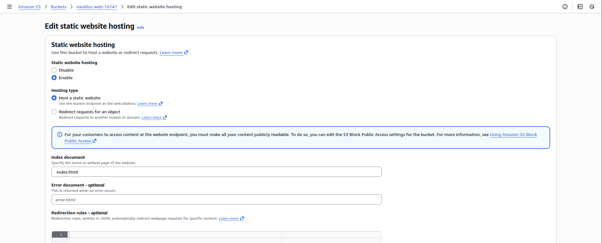
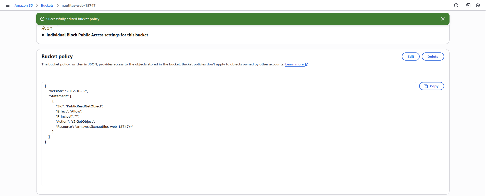

<!-- NAV_START -->
[⬅️ Back to Main README](../README.md) | [◀️ Previous Day](../Day%2038.%20Deploying%20Containerized%20Applications%20with%20Amazon%20ECS) | [Next Day ▶️](../Day%2040.%20Troubleshooting%20Internet%20Accessibility%20for%20an%20EC2-Hosted%20Application)
<!-- NAV_END -->

Step 1: Create the S3 Bucket

Log in to the AWS Management Console

Navigate to S3 → Create bucket

Bucket Configuration

Bucket name:

nautilus-web-18747


Region: Same as aws-client (recommended)

Object Ownership: ACLs disabled

Block Public Access:
❌ Uncheck “Block all public access”

Acknowledge the public access warning

Leave other settings as default

Click Create bucket

Step 2: Enable Static Website Hosting

Open the bucket nautilus-web-18747

Go to the Properties tab

Scroll to Static website hosting

Click Edit

Settings

Enable: Static website hosting

Hosting type: Host a static website

Index document:

index.html


Click Save changes



Copy the Bucket website endpoint (used later)

Step 3: Allow Public Read Access (Bucket Policy)

Go to the Permissions tab of the bucket

Open Bucket policy

Paste the following policy (replace bucket name if needed):
```
{
  "Version": "2012-10-17",
  "Statement": [
    {
      "Sid": "PublicReadGetObject",
      "Effect": "Allow",
      "Principal": "*",
      "Action": "s3:GetObject",
      "Resource": "arn:aws:s3:::nautilus-web-18747/*"
    }
  ]
}
```

Click Save changes

✅ This allows public users to read website files.



Step 4: Upload index.html from aws-client

Log in to the aws-client host
```
# Verify file exists:
ls /root/index.html

# Upload the file:
aws s3 cp /root/index.html s3://nautilus-web-18747/


# Confirm upload:
aws s3 ls s3://nautilus-web-18747/

```

You should see:

index.html

Step 5: Verify Website Access

Open a browser

Paste the S3 Website Endpoint:

http://nautilus-web-18747.s3-website-<region>.amazonaws.com


You should see the content of index.html

---

<!-- NAV_START -->
[⬅️ Back to Main README](../README.md) | [◀️ Previous Day](../Day%2038.%20Deploying%20Containerized%20Applications%20with%20Amazon%20ECS) | [Next Day ▶️](../Day%2040.%20Troubleshooting%20Internet%20Accessibility%20for%20an%20EC2-Hosted%20Application)
<!-- NAV_END -->
