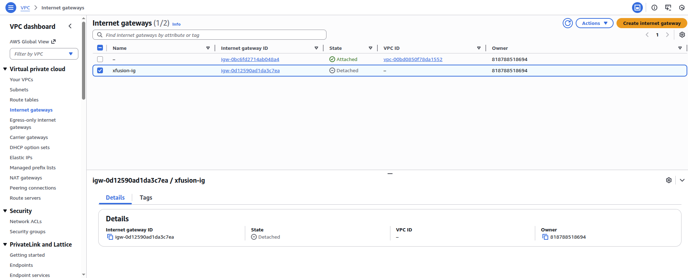
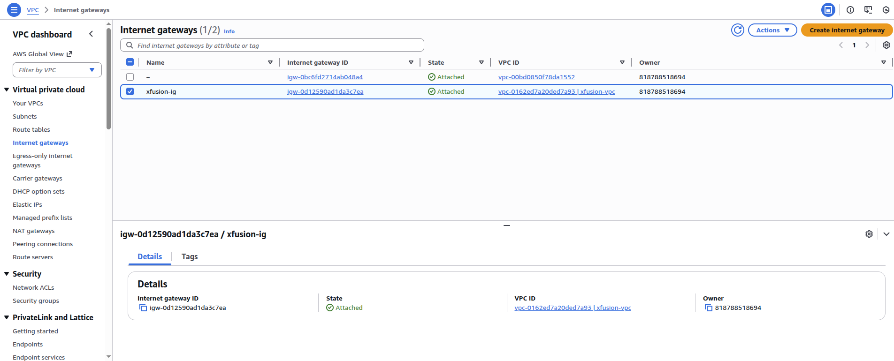
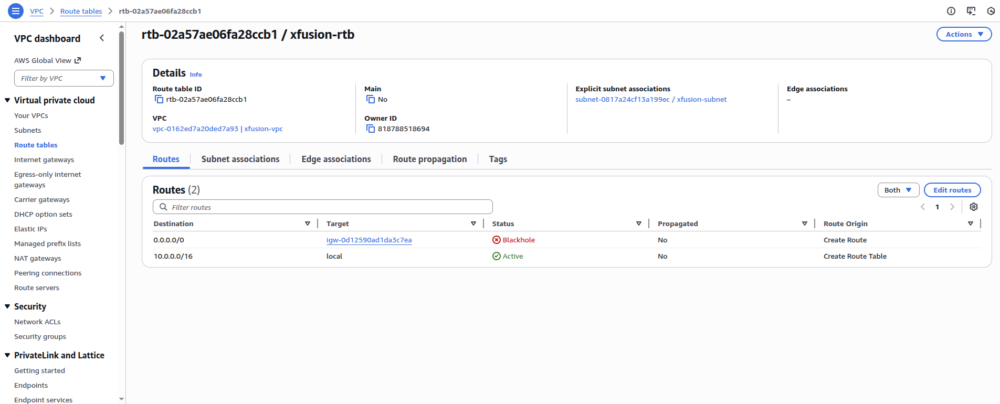
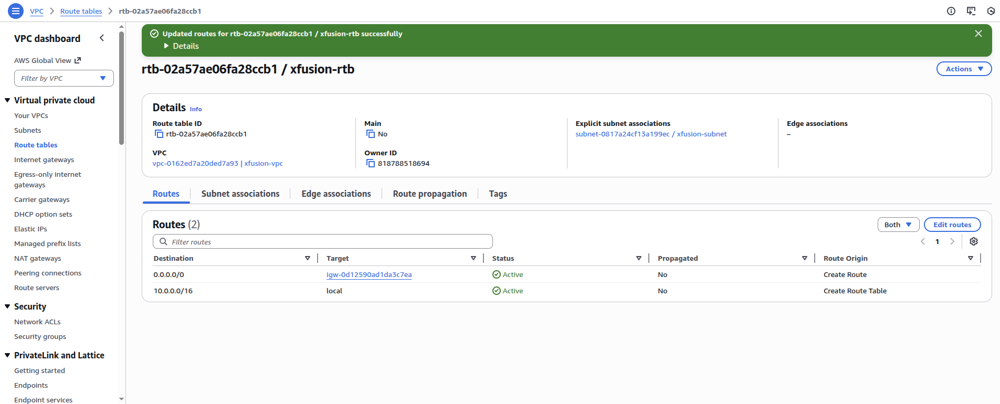
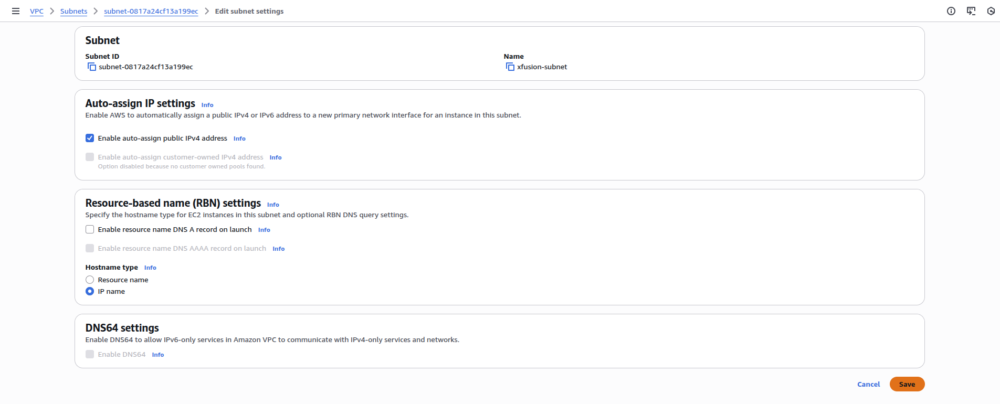

Step 1: Verify Internet Gateway (IGW) for xfusion-vpc

Go to VPC → Internet Gateways

Check if an Internet Gateway exists and is attached to xfusion-vpc

Select the IGW → Actions → Attach to VPC

Choose:

xfusion-vpc

✅ VPC now has a path to the internet

Step 2: Verify Route Table Configuration

Go to VPC → Route Tables

Identify the route table associated with the public subnet of xfusion-ec2

Check Subnet associations

Open Routes tab

Ensure this route exists:

Destination: 0.0.0.0/0
Target: Internet Gateway (igw-xxxx)

IPlease delete and add as New routes

Add route:

Destination: 0.0.0.0/0

Target: Internet Gateway

Save changes

✅ Subnet is now public

Step 3: Verify Subnet Auto-Assign Public IP

Go to VPC → Subnets

Select the subnet where xfusion-ec2 is running

Click Edit subnet settings

Ensure:

Enable auto-assign public IPv4 address ✔

Save

⚠️ If disabled, new instances won’t get public IPs automatically

Step 4: Verify EC2 Has a Public IP

Go to EC2 → Instances

Select xfusion-ec2

Check:

Public IPv4 address

Step 5: Final Internet Access Test

Open browser

Visit:

http://<EC2_PUBLIC_IP>

✅ You should now see the Nginx Welcome Page

✅ Issue Resolved – Root Cause Identified

---