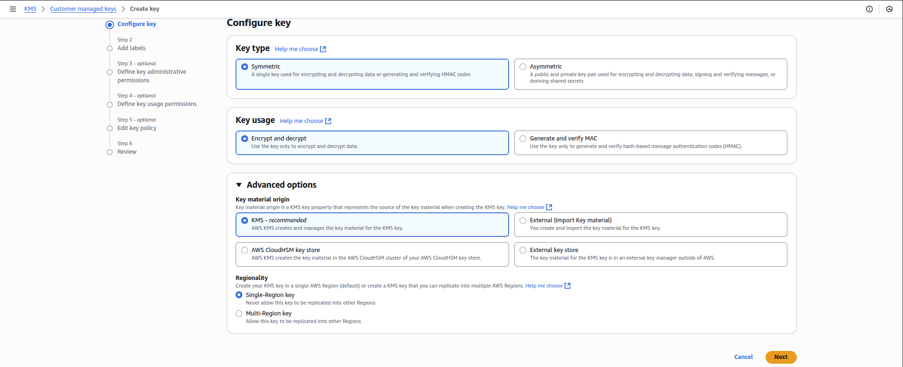
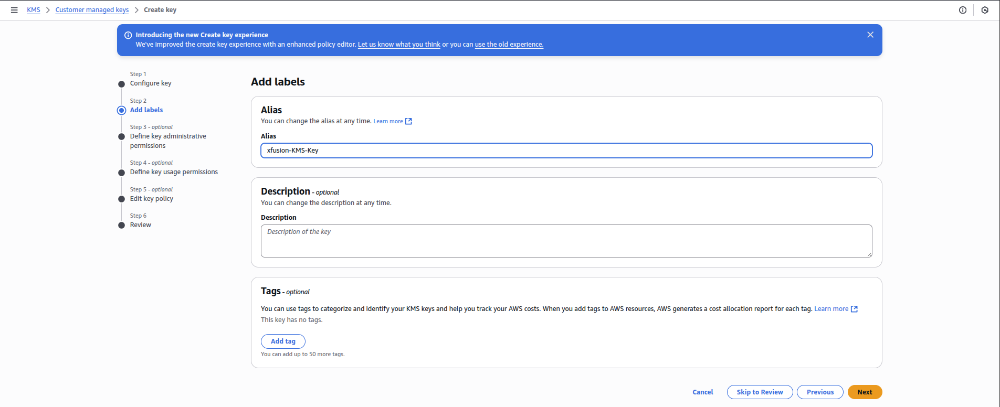
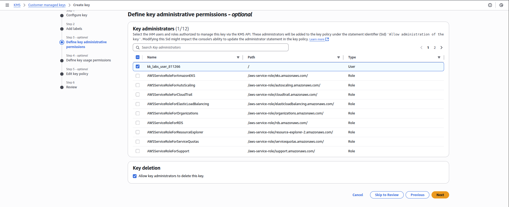
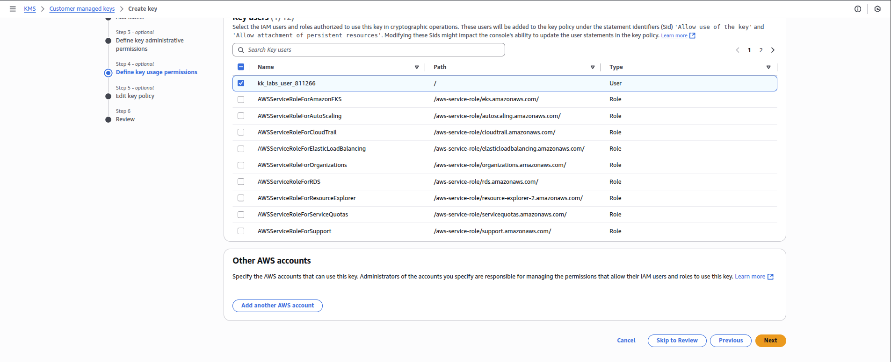
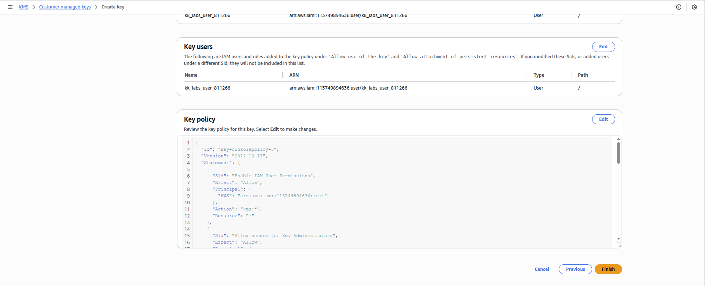
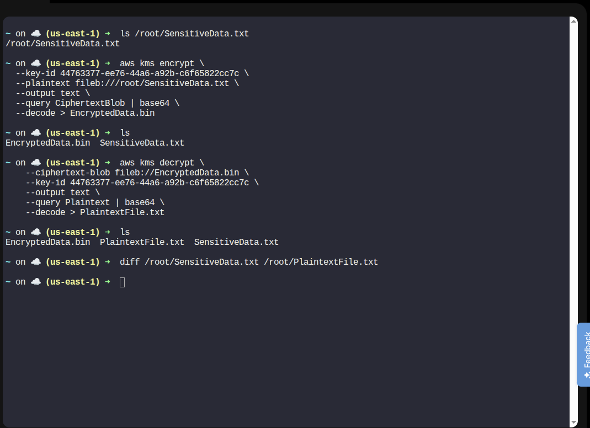

Step 1: Create a Symmetric KMS Key

Log in to the AWS Management Console

Go to KMS → Customer managed keys

Click Create key

Key Configuration

Key type: Symmetric

Key usage: Encrypt and decrypt

Advanced options: Default

Click Next



Alias

Alias name:

xfusion-KMS-Key


Click Next



Key Administrators

Select your IAM user / role

Click Next



Key Users

Allow the same IAM user / role to use the key

Click Next



Review and click Next and then Finish



✅ Symmetric KMS key is now created and ready for use.

Step 2: Verify the Sensitive File Exists

On the aws-client host:

ls /root/SensitiveData.txt


You should see:

/root/SensitiveData.txt

Step 3: Encrypt the File Using KMS
3.1 Encrypt the File

Run the following command:

```
aws kms encrypt \
  --key-id 44763377-ee76-44a6-a92b-c6f65822cc7c \
  --plaintext fileb:///root/SensitiveData.txt \
  --output text \
  --query CiphertextBlob | base64 \
  --decode > EncryptedData.bin
```

Step 5: Verify Data Integrity

```
aws kms decrypt \
    --ciphertext-blob fileb://EncryptedData.bin \
    --key-id 44763377-ee76-44a6-a92b-c6f65822cc7c \
    --output text \
    --query Plaintext | base64 \
    --decode > PlaintextFile.txt
```

Compare original and decrypted files:
```
diff /root/SensitiveData.txt /root/PlaintextFile.txt
```
Expected result:

No output → files are identical ✅



---