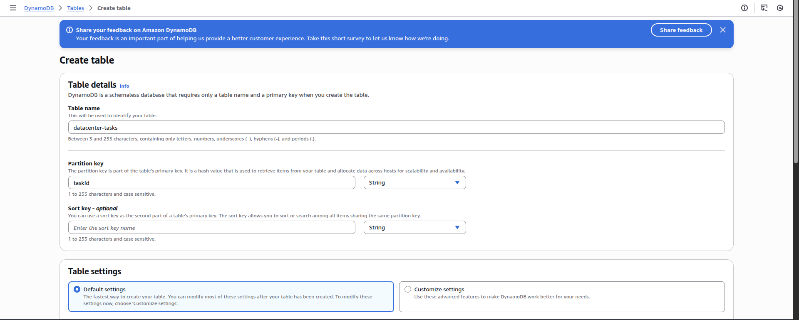
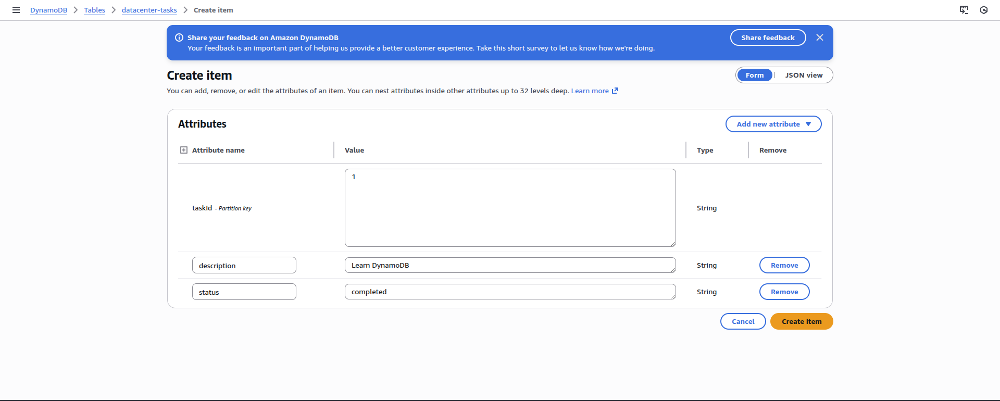
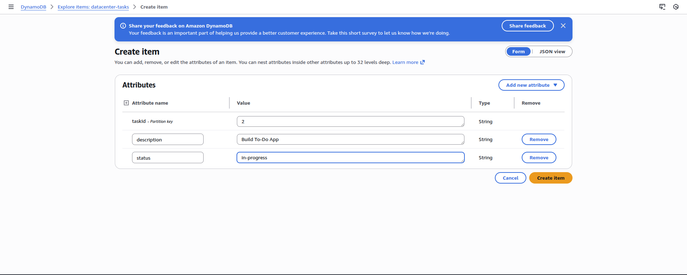
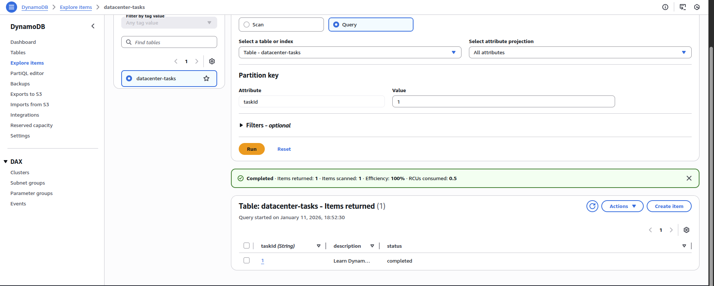
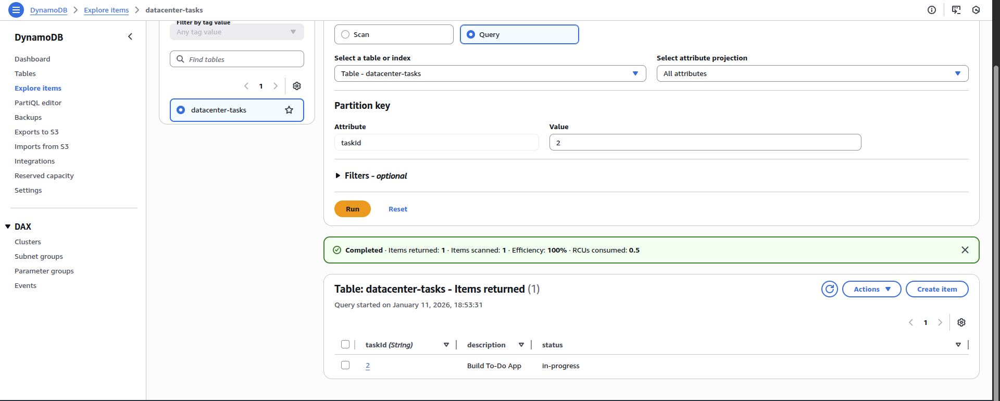

<!-- NAV_START -->
[⬅️ Back to Main README](../README.md) | [◀️ Previous Day](../Day%2041.%20Securing%20Data%20with%20AWS%20KMS) | [Next Day ▶️](../Day%2043.%20Scaling%20and%20Managing%20Kubernetes%20Clusters%20with%20Amazon%20EKS)
<!-- NAV_END -->

Step 1: Create the DynamoDB Table
Using AWS Console

Log in to the AWS Management Console

Navigate to DynamoDB → Tables

Click Create table

Table Configuration

Table name:

`datacenter-tasks`

Partition key:

`taskId`

Key type: String

Leave all other settings as default

Click Create table

Wait until table status becomes:

ACTIVE

SStep 2: Open the Items Section

Inside the table, click the Explore table items (or Items) tab

Click Create item

Step 3: Insert Task 1 (Learn DynamoDB)

You will see a JSON editor or form view.

Enter the following:

taskId (String):

1

Click Add new attribute

Name: description

Type: String

Value:

Learn DynamoDB

Click Add new attribute

Name: status

Type: String

Value:

completed

Final item should look like:
{
  "taskId": "1",
  "description": "Learn DynamoDB",
  "status": "completed"
}

Click Create item

✅ Task 1 inserted successfully

Step 4: Insert Task 2 (Build To-Do App)

Click Create item again

Enter the following:

taskId (String):

2

description (String):

Build To-Do App

status (String):

in-progress

Final item:
{
  "taskId": "2",
  "description": "Build To-Do App",
  "status": "in-progress"
}

Click Create item

✅ Task 2 inserted successfully

Step 5: Verify Items via Console

Stay in Explore table items

You should now see two rows:

taskId	description	status
1	Learn DynamoDB	completed
2	Build To-Do App	in-progress

Click each item to verify values if needed

---

<!-- NAV_START -->
[⬅️ Back to Main README](../README.md) | [◀️ Previous Day](../Day%2041.%20Securing%20Data%20with%20AWS%20KMS) | [Next Day ▶️](../Day%2043.%20Scaling%20and%20Managing%20Kubernetes%20Clusters%20with%20Amazon%20EKS)
<!-- NAV_END -->
