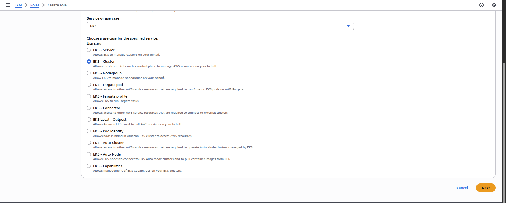
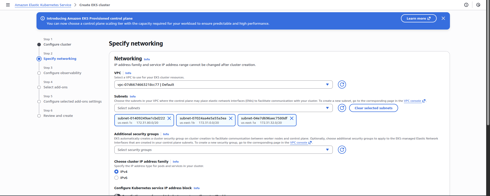
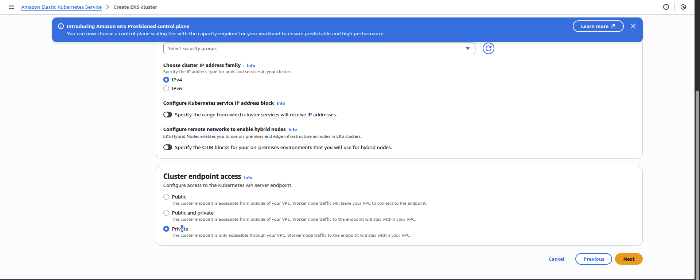
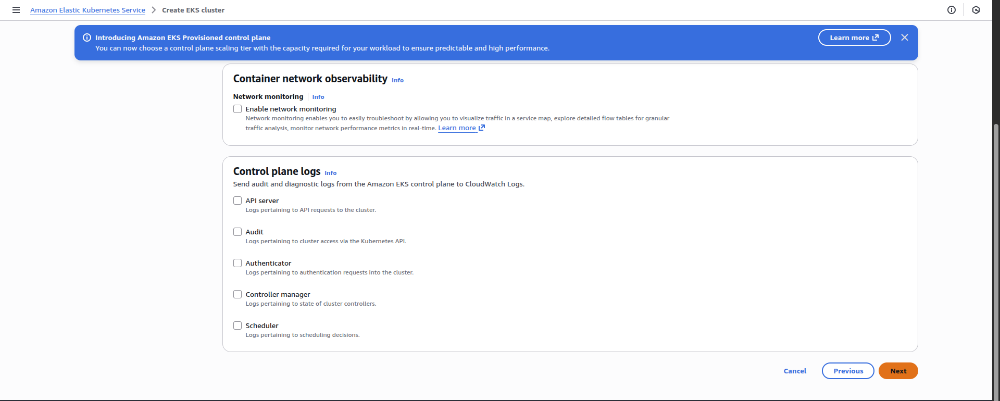
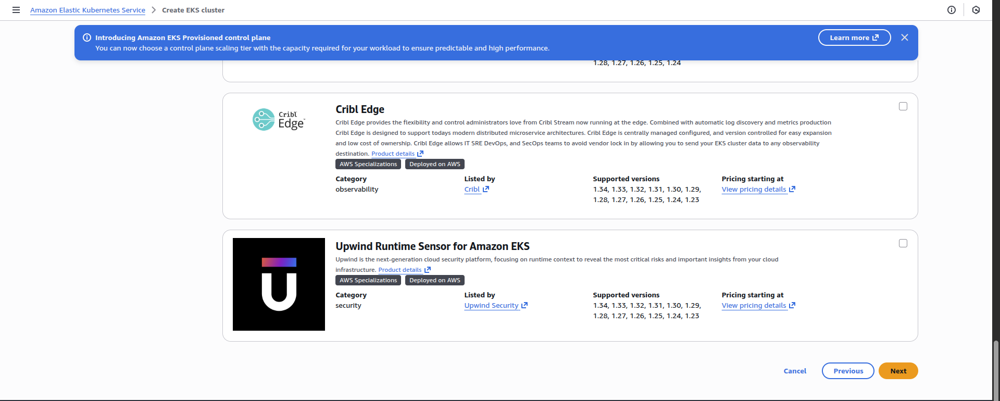
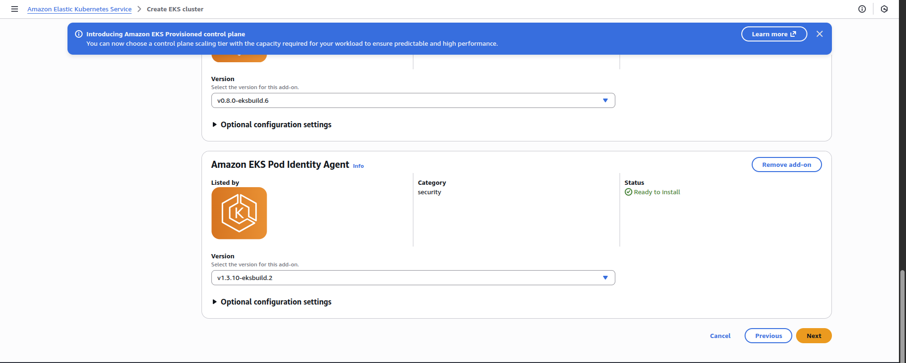

Step 1: Create IAM Role for EKS Cluster
1.1 Open IAM Console

Go to AWS Console → IAM

Click Roles → Create role

1.2 Configure Trusted Entity

Trusted entity type: AWS service

Use case: EKS

Specific use case: EKS – Cluster

Click Next

1.3 Attach Required Policy

Attach this policy:

✅ AmazonEKSClusterPolicy

Click Next

1.4 Name the Role

Role name:

`eksClusterRole`

Click Create role

✅ IAM role for EKS is ready

Step 2: Create the EKS Cluster
2.1 Open EKS Console

Go to Services → Amazon EKS

Click Clusters → Create cluster

2.2 Custom Configuration [Disalbe-Use EKS Auto Mode]

Name:

`xfusion-eks`

Cluster service role:

eksClusterRole

Kubernetes version:

1.30

Click Next

Step 3: Networking Configuration
3.1 VPC Settings

VPC: Default VPC

Subnets:
Select subnets from:

us-east-1a

us-east-1b

us-east-1c

(One subnet per AZ is sufficient)

3.2 Endpoint Access (IMPORTANT)

Configure as follows:

❌ Public access → Disabled

✅ Private access → Enabled

This ensures:

No public API exposure

Cluster accessible only from inside the VPC

3.3 Security Groups

Leave default security group selected

Click Next

Step 4: Logging & Add-ons

Leave Control plane logging as default

Leave Add-ons unchanged

Click Next

Step 5: Review and Create

Review all settings:

Cluster name: xfusion-eks

Kubernetes version: 1.30

Endpoint access: Private

VPC: Default

AZs: a, b, c

Click Create

Step 6: Wait for Cluster Creation

⏳ Cluster creation typically takes 10–15 minutes

Go to EKS → Clusters

Select xfusion-eks

Wait until Status shows:

ACTIVE

Step 7: Verify Cluster Configuration

Inside the cluster details page, verify:

✔ Cluster Status
ACTIVE

✔ Kubernetes Version
1.30

✔ Endpoint Access
Private only

✔ VPC & Subnets

Default VPC

Subnets in AZs a, b, c

---