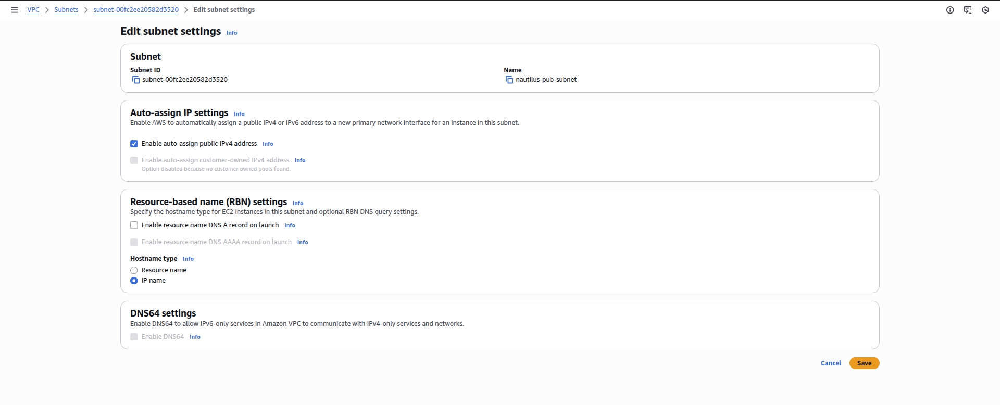
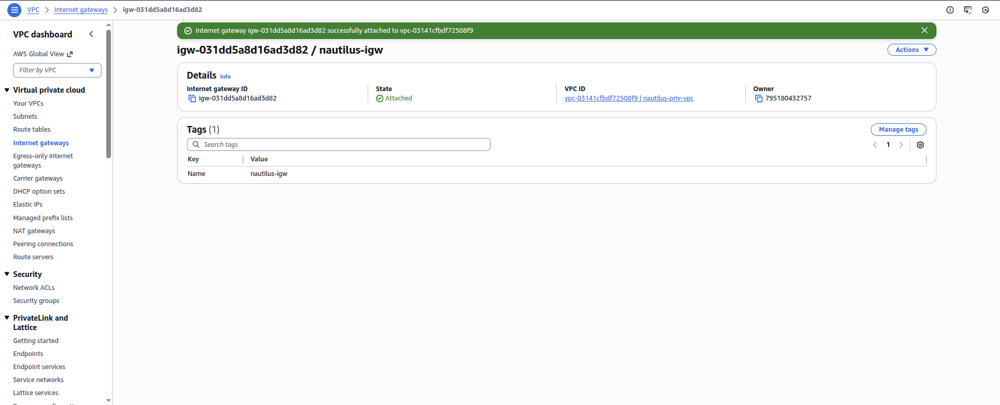
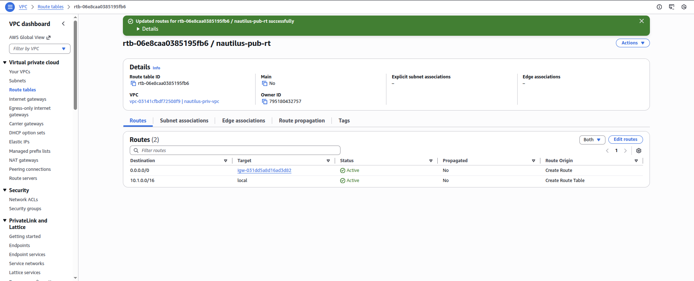
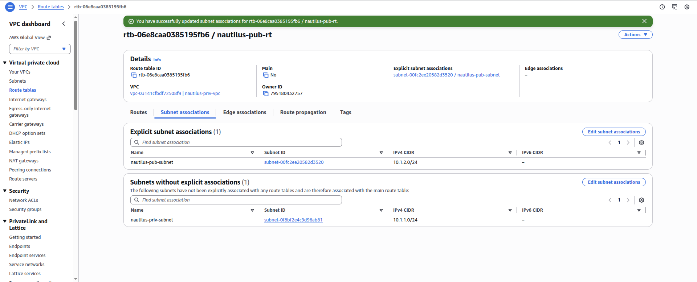
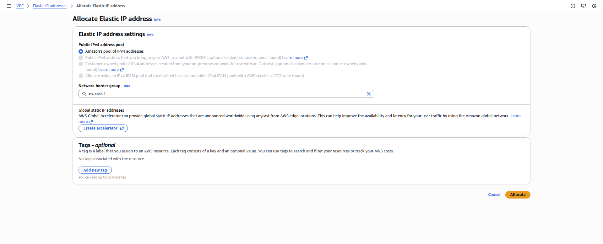
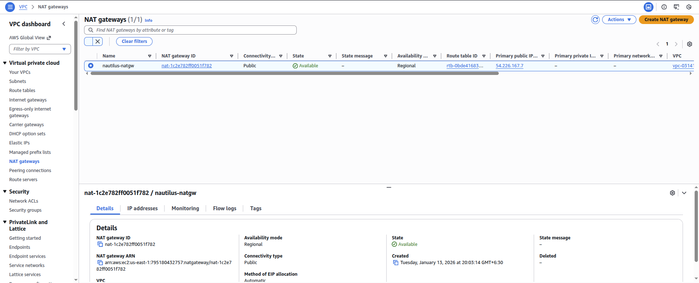
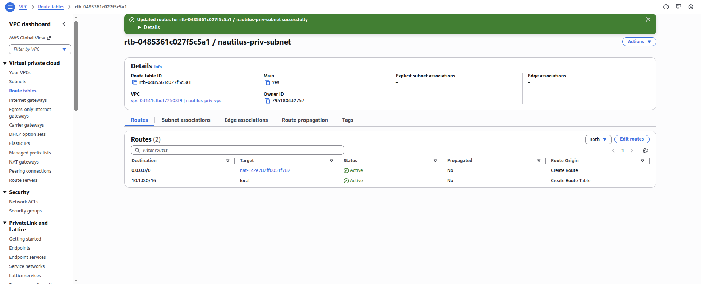
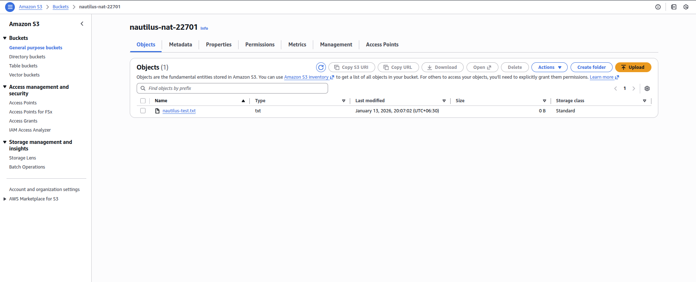

<!-- NAV_START -->
[⬅️ Back to Main README](../README.md) | [◀️ Previous Day](../Day%2044.%20Implementing%20Auto%20Scaling%20for%20High%20Availability%20in%20AWS) | [Next Day ▶️](../Day%2046.%20Event-Driven%20Processing%20with%20Amazon%20S3%20and%20Lambda)
<!-- NAV_END -->

Step 1: Create a Public Subnet

Go to VPC → Subnets → Create subnet

Configure:

VPC: `nautilus-priv-vpc`

Subnet name: `nautilus-pub-subnet`

Availability Zone: Any (same region)

IPv4 CIDR block: Example

10.1.2.0/24

Click Create subnet

Enable Auto-Assign Public IP

Select nautilus-pub-subnet

Click Edit subnet settings

Enable:

Auto-assign public IPv4 address ✔

Save changes

Step 2: Create and Attach Internet Gateway

Go to VPC → Internet Gateways

Click Create internet gateway

Name:

`nautilus-igw`

Click Create

Select the IGW → Actions → Attach to VPC

Choose:

nautilus-priv-vpc

Attach

Step 3: Create Public Route Table

Go to VPC → Route Tables → Create route table

Configure:

Name: `nautilus-pub-rt`

VPC: `nautilus-priv-vpc`

Click Create

Add Internet Route

Select nautilus-pub-rt

Go to Routes → Edit routes

Add route:

Destination: 0.0.0.0/0
Target: Internet Gateway (nautilus-igw)

Save changes

Associate with Public Subnet

Go to Subnet associations → Edit

Select:

`nautilus-pub-subnet`

Save

Step 4: Create NAT Gateway

Allocate Elastic IP

Go to EC2 → Elastic IPs

Click Allocate Elastic IP

Allocate

Create NAT Gateway

Go to VPC → NAT Gateways → Create NAT Gateway

Configure:

Name: `nautilus-natgw`

VPC: `nautilus-priv-vpc`

Elastic IP: Select allocated EIP

Click Create NAT Gateway

Wait until status becomes:

Available

Step 5: Update Private Route Table

Go to VPC → Route Tables

Select the route table associated with:

`nautilus-priv-subnet`

Go to Routes → Edit routes

Add route:

Destination: 0.0.0.0/0
Target: NAT Gateway (nautilus-natgw)

Save changes

Associate with Public Subnet

Go to Subnet associations → Edit

Select:

`nautilus-priv-subnet`

Save

Step 6: Verify Internet Access via S3 Upload
What Happens Automatically

nautilus-priv-ec2 already has a cron job

Once internet access works, it uploads a file to:

s3://nautilus-nat-22701

⏳ Wait 2–3 minutes

Verify in S3

Go to S3 → Buckets → nautilus-nat-22701

Check Objects

✅ You should see a new test file uploaded

---

<!-- NAV_START -->
[⬅️ Back to Main README](../README.md) | [◀️ Previous Day](../Day%2044.%20Implementing%20Auto%20Scaling%20for%20High%20Availability%20in%20AWS) | [Next Day ▶️](../Day%2046.%20Event-Driven%20Processing%20with%20Amazon%20S3%20and%20Lambda)
<!-- NAV_END -->
