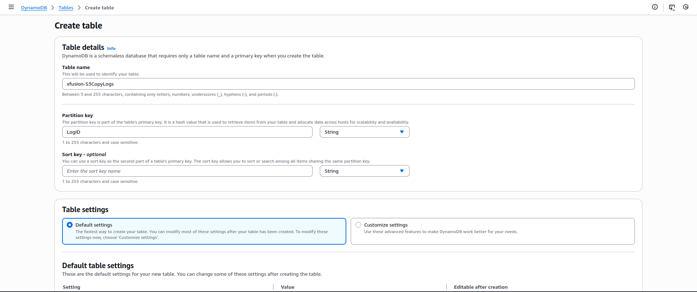
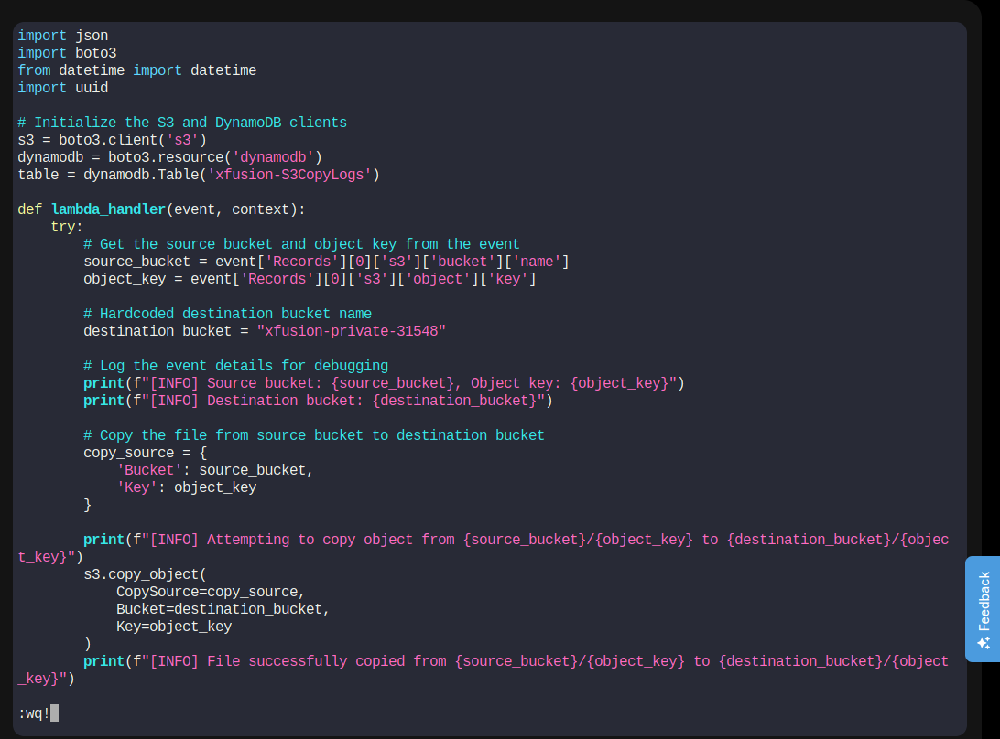
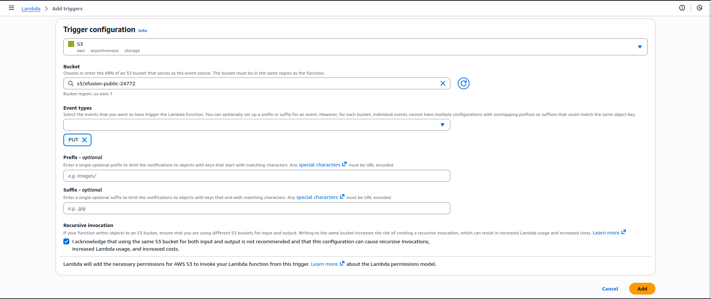
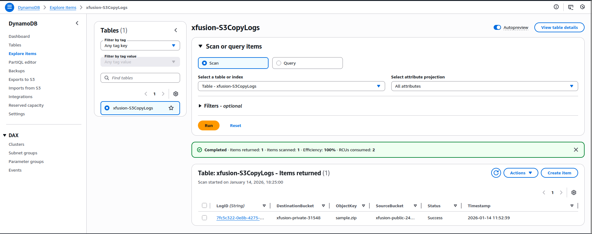

Architecture 


Public S3 Bucket
     │ (upload)
     ▼
Lambda Function
     ├── Copy file → Private S3 Bucket
     └── Log entry → DynamoDB


Step 1: Create Public S3 Bucket

Go to S3 → Create bucket

Configure:

Bucket name:

`xfusion-public-24772`


Region: Same as Lambda

Block Public Access: ❌ Uncheck Block all public access

Acknowledge the warning

Create bucket

Allow Public Read (Required)

Open bucket → Permissions

Add this Bucket Policy:

```
{
  "Version": "2012-10-17",
  "Statement": [
    {
      "Effect": "Allow",
      "Principal": "*",
      "Action": "s3:GetObject",
      "Resource": "arn:aws:s3:::xfusion-public-24772/*"
    }
  ]
}
```

Step 2: Create Private S3 Bucket

Go to S3 → Create bucket

Configure:

Bucket name:

`xfusion-private-31548`


Block Public Access: ✅ Keep enabled

Create bucket

✅ This bucket remains private

Step 3: Create DynamoDB Table

Go to DynamoDB → Create table

Configure:

Table name:

`xfusion-S3CopyLogs`


Partition key:

LogID (String)


Leave defaults

Create table

Wait until status = ACTIVE



Step 4: Create IAM Role for Lambda
4.1 Create Role

Go to IAM → Roles → Create role

Trusted entity:

AWS service

Lambda

Next

4.2 Attach Policies

Attach these AWS managed policies:

`AWSLambdaBasicExecutionRole`

`AmazonS3FullAccess`

`AmazonDynamoDBFullAccess`

(FullAccess is acceptable for labs)

Role name:

`lambda_execution_role`


Create role

Step 5: Prepare Lambda Code

On the aws-client host:
```
vi lambda-function.py
```
Replace These Values
DYNAMODB_TABLE = "xfusion-S3CopyLogs"
DESTINATION_BUCKET = "xfusion-private-31548"


✅ Save the file



Step 6: Create Lambda Function


6.1 Create Function

Go to Lambda → Create function

Choose Author from scratch

Configure:

Function name:

`xfusion-copyfunction`


Runtime: Python 3.9

Execution role: Use existing role

Role: `lambda_execution_role`

Create function

6.2 Upload Code

Open the function

Update lambda-function.py 

Click Deploy

Step 7: Add S3 Trigger to Lambda

In Lambda → Add trigger

Select S3

Configure:

Bucket: xfusion-public-24772

Event type: PUT

Acknowledge permission prompt

Add trigger



Step 8: Test the Setup
Upload Test File

From aws-client:

```
aws s3 cp /root/sample.zip s3://xfusion-public-24772/
```

Step 9: Verify File Copy

Go to S3 → xfusion-private-31548

Confirm:

sample.zip


✅ File copied successfully

Step 10: Verify DynamoDB Logs

Go to DynamoDB → Tables → xfusion-S3CopyLogs

Click Explore table items

You should see an entry with:

Source bucket

Destination bucket

Object key (sample.zip)



---