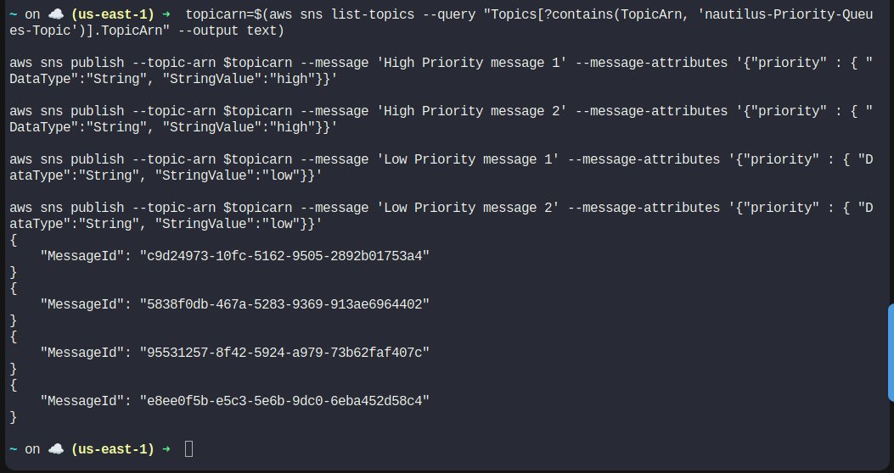
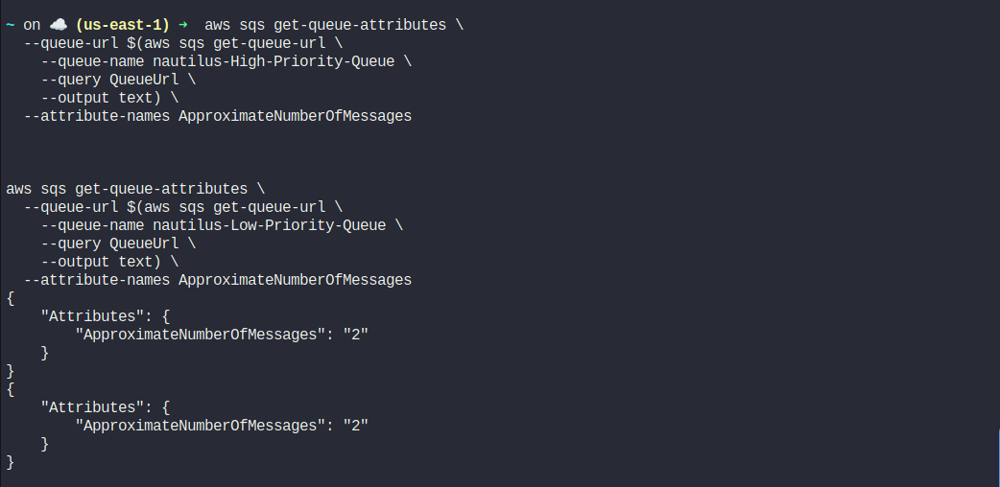
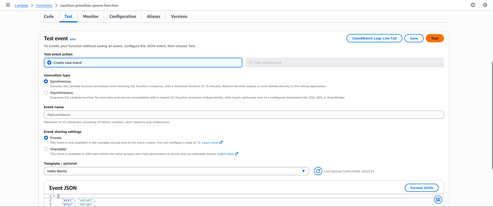
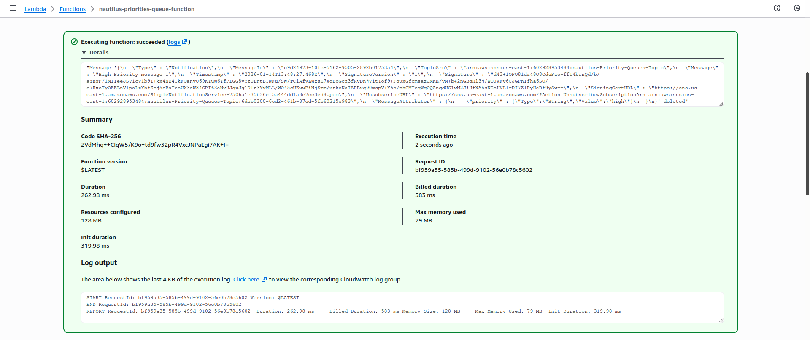
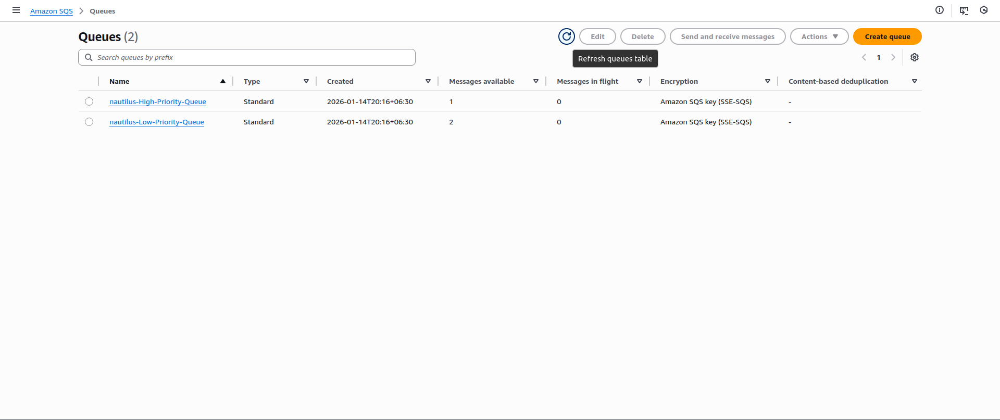
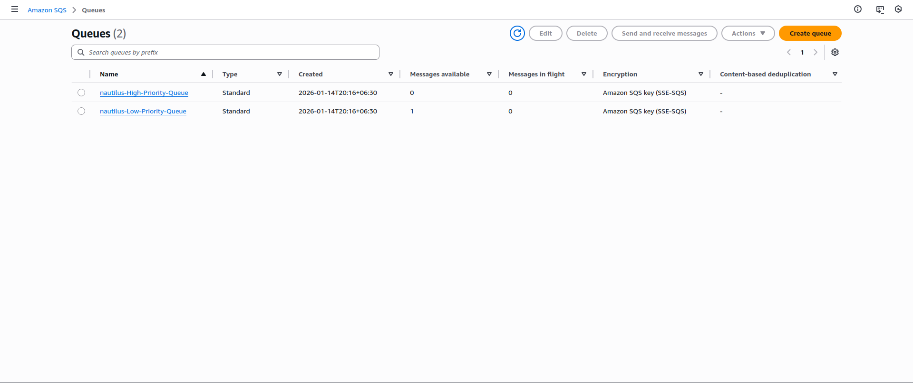

<!-- NAV_START -->
[⬅️ Back to Main README](../README.md) | [◀️ Previous Day](../Day%2046.%20Event-Driven%20Processing%20with%20Amazon%20S3%20and%20Lambda) | [Next Day ▶️](../Day%2048.%20Automating%20Infrastructure%20Deployment%20with%20AWS%20CloudFormation)
<!-- NAV_END -->

Architecture

SNS Topic
   │
   ├─(priority=high)──▶ High Priority SQS
   └─(priority=low) ──▶ Low Priority SQS

Lambda Function
   ├─ Reads High Priority Queue FIRST
   └─ Then processes Low Priority Queue


Step 1: Create CloudFormation Template

On the AWS client host, create the file exactly here:
```
vi nautilus-priority-stack.yml
```

Step 2: Paste This CloudFormation Template


```
AWSTemplateFormatVersion: '2010-09-09'
Description: Priority Queue Processing Stack
Resources:
  
  HighPriorityQueue:
    Type: AWS::SQS::Queue
    Properties:
      QueueName: nautilus-High-Priority-Queue
      VisibilityTimeout: 60

  LowPriorityQueue:
    Type: AWS::SQS::Queue
    Properties:
      QueueName: nautilus-Low-Priority-Queue
      VisibilityTimeout: 60

  PriorityQueuesTopic:
    Type: AWS::SNS::Topic
    Properties:
      TopicName: nautilus-Priority-Queues-Topic

  HighPrioritySubscription:
    Type: AWS::SNS::Subscription
    Properties:
      TopicArn: !Ref PriorityQueuesTopic
      Protocol: sqs
      Endpoint: !GetAtt HighPriorityQueue.Arn
      FilterPolicy:
        priority:
          - high

  LowPrioritySubscription:
    Type: AWS::SNS::Subscription
    Properties:
      TopicArn: !Ref PriorityQueuesTopic
      Protocol: sqs
      Endpoint: !GetAtt LowPriorityQueue.Arn
      FilterPolicy:
        priority:
          - low 

  HighPriorityPolicy:
    Type: AWS::SQS::QueuePolicy
    Properties:
      Queues:
        - !Ref HighPriorityQueue
      PolicyDocument:
        Statement:
          - Effect: Allow
            Principal: "*"
            Action: SQS:SendMessage
            Resource: !GetAtt HighPriorityQueue.Arn
            Condition:
              ArnEquals:
                aws:SourceArn: !Ref PriorityQueuesTopic
                
  LowPriorityPolicy:
    Type: AWS::SQS::QueuePolicy
    Properties:
      Queues:    
        - !Ref LowPriorityQueue
      PolicyDocument:
        Statement:
          - Effect: Allow
            Principal: "*"  
            Action: SQS:SendMessage
            Resource: !GetAtt LowPriorityQueue.Arn
            Condition:
              ArnEquals:
                aws:SourceArn: !Ref PriorityQueuesTopic

  LambdaExecutionRole:
    Type: AWS::IAM::Role
    Properties:
      RoleName: lambda_execution_role
      AssumeRolePolicyDocument:
        Version: '2012-10-17'
        Statement:
          - Effect: Allow
            Principal:
              Service: lambda.amazonaws.com
            Action: sts:AssumeRole
      ManagedPolicyArns:
        - arn:aws:iam::aws:policy/service-role/AWSLambdaBasicExecutionRole
        - arn:aws:iam::aws:policy/AmazonSQSFullAccess
        - arn:aws:iam::aws:policy/AmazonSNSFullAccess

  PriorityLambdaFunction:
    Type: AWS::Lambda::Function
    Properties:
      FunctionName: nautilus-priorities-queue-function
      Runtime: python3.9
      Handler: index.lambda_handler
      Role: !GetAtt LambdaExecutionRole.Arn
      Timeout: 5
      Environment:
        Variables:
          high_priority_queue: !Ref HighPriorityQueue
          low_priority_queue: !Ref LowPriorityQueue
      Code:
        S3Bucket: kklabsuser-911514
        S3Key: function-code.zip
```

Save and exit.

Create the S3 bucket & Upload the file immediately

```
zip function.zip index.py
aws s3 mb s3://kklabsuser-911514
aws s3 cp function-code.zip s3://kklabsuser-911514/function-code.zip
```

Step 3: Deploy the CloudFormation Stack

Run exactly:

```
aws cloudformation create-stack \
  --stack-name nautilus-priority-stack \
  --template-body file:///root/nautilus-priority-stack.yml \
  --capabilities CAPABILITY_NAMED_IAM
```

Step 4: Wait for Stack Completion
```
aws cloudformation wait stack-create-complete \
  --stack-name nautilus-priority-stack
```

✅ Stack status must be CREATE_COMPLETE


Step 5: Test Priority Processing
Get SNS Topic ARN
```
aws sns list-topics 
```

Publish Messages (As Given in Lab)

```
topicarn=$(aws sns list-topics --query "Topics[?contains(TopicArn, 'nautilus-Priority-Queues-Topic')].TopicArn" --output text)

aws sns publish --topic-arn $topicarn --message 'High Priority message 1' --message-attributes '{"priority" : { "DataType":"String", "StringValue":"high"}}'

aws sns publish --topic-arn $topicarn --message 'High Priority message 2' --message-attributes '{"priority" : { "DataType":"String", "StringValue":"high"}}'

aws sns publish --topic-arn $topicarn --message 'Low Priority message 1' --message-attributes '{"priority" : { "DataType":"String", "StringValue":"low"}}'

aws sns publish --topic-arn $topicarn --message 'Low Priority message 2' --message-attributes '{"priority" : { "DataType":"String", "StringValue":"low"}}'
```


Step 7: Verify Priority Order
Check SQS Queues
```
aws sqs get-queue-attributes \
  --queue-url $(aws sqs get-queue-url \
    --queue-name nautilus-High-Priority-Queue \
    --query QueueUrl \
    --output text) \
  --attribute-names ApproximateNumberOfMessages


aws sqs get-queue-attributes \
  --queue-url $(aws sqs get-queue-url \
    --queue-name nautilus-Low-Priority-Queue \
    --query QueueUrl \
    --output text) \
  --attribute-names ApproximateNumberOfMessages

```



Step 8: Test Lambda for Low Priority Order












---

<!-- NAV_START -->
[⬅️ Back to Main README](../README.md) | [◀️ Previous Day](../Day%2046.%20Event-Driven%20Processing%20with%20Amazon%20S3%20and%20Lambda) | [Next Day ▶️](../Day%2048.%20Automating%20Infrastructure%20Deployment%20with%20AWS%20CloudFormation)
<!-- NAV_END -->
