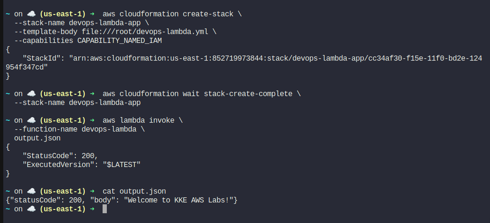

<!-- NAV_START -->
[⬅️ Back to Main README](../README.md) | [◀️ Previous Day](../Day%2047.%20Integrating%20AWS%20SQS%20and%20SNS%20for%20Reliable%20Messaging) | [Next Day ▶️](../Day%2049.%20Centralized%20Audit%20Logging%20with%20VPC%20Peering)
<!-- NAV_END -->

📄 CloudFormation Template
```
vi devops-lambda.yml
```

```
AWSTemplateFormatVersion: '2010-09-09'
Description: DevOps Lambda Application Stack

Resources:

  LambdaExecutionRole:
    Type: AWS::IAM::Role
    Properties:
      RoleName: lambda_execution_role
      AssumeRolePolicyDocument:
        Version: '2012-10-17'
        Statement:
          - Effect: Allow
            Principal:
              Service: lambda.amazonaws.com
            Action: sts:AssumeRole
      ManagedPolicyArns:
        - arn:aws:iam::aws:policy/service-role/AWSLambdaBasicExecutionRole

  DevOpsLambdaFunction:
    Type: AWS::Lambda::Function
    Properties:
      FunctionName: devops-lambda
      Runtime: python3.9
      Handler: index.lambda_handler
      Role: !GetAtt LambdaExecutionRole.Arn
      Timeout: 10
      Code:
        ZipFile: |
          def lambda_handler(event, context):
              return {
                  "statusCode": 200,
                  "body": "Welcome to KKE AWS Labs!"
              }
```

🚀 Deploy the Stack
```
aws cloudformation create-stack \
  --stack-name devops-lambda-app \
  --template-body file:///root/devops-lambda.yml \
  --capabilities CAPABILITY_NAMED_IAM
```

Wait for completion:
```
aws cloudformation wait stack-create-complete \
  --stack-name devops-lambda-app
```
🧪 (Optional) Test the Lambda
```
aws lambda invoke \
  --function-name devops-lambda \
  output.json
```
cat output.json


Expected output:

{
  "statusCode": 200,
  "body": "Welcome to KKE AWS Labs!"
}



---

<!-- NAV_START -->
[⬅️ Back to Main README](../README.md) | [◀️ Previous Day](../Day%2047.%20Integrating%20AWS%20SQS%20and%20SNS%20for%20Reliable%20Messaging) | [Next Day ▶️](../Day%2049.%20Centralized%20Audit%20Logging%20with%20VPC%20Peering)
<!-- NAV_END -->
