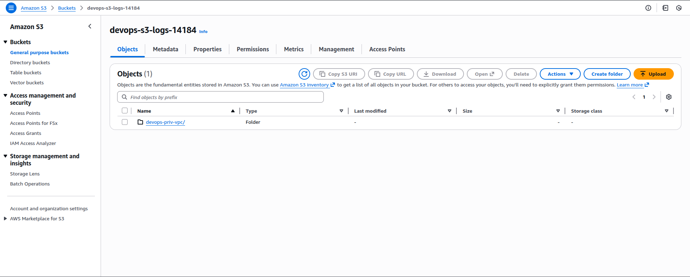

🔹 Step 1: Create Public VPC

AWS Console → VPC → Create VPC

Name: `devops-pub-vpc`

CIDR: 10.20.0.0/16

Create.

🔹 Step 2: Create Public Subnet

VPC → Subnets → Create subnet

VPC: `devops-pub-vpc`

Name: `devops-pub-subnet`

CIDR: 10.20.1.0/24

AZ: any

After creation:

Enable Auto-assign public IPv4

🔹 Step 3: Internet Gateway

VPC → Internet Gateways → Create

Name: `devops-pub-igw`

Attach to devops-pub-vpc.

🔹 Step 4: Public Route Table

VPC → Route Tables → Create

Name: `devops-pub-rt`

VPC: `devops-pub-vpc`

Add route:

0.0.0.0/0 → Internet Gateway

Associate with devops-pub-subnet.

PART 2: EC2 & S3
🔹 Step 5: Launch Public EC2

EC2 → Launch Instance

Name: `devops-pub-ec2`

AMI: Ubuntu

Instance type: lab default

Key pair: devops-key.pem

VPC: `devops-pub-vpc`

Subnet: `devops-pub-subnet`

Public IP: Enabled

Create Security Group and allow SSH

Launch.

🔹 Step 6: Create S3 Bucket

S3 → Create bucket

Bucket name: `devops-s3-logs-14184`

Block all public access: ON

Create.

🔹 Step 7: IAM Role for S3

IAM → Roles → Create role

Service or use case - EC2

AmazonS3FullAccess

Role name: `devops-s3-role`

Attach role to devops-pub-ec2.

PART 3: VPC PEERING
🔹 Step 8: Create VPC Peering

VPC → Peering Connections → Create

Name: `devops-vpc-peering`

Requester: `devops-priv-vpc`

Accepter: `devops-pub-vpc`

Accept the peering request.

🔹 Step 9: Update Route Tables
devops-priv-rt

Add route:

Destination: 10.20.0.0/16

Target: peering connection

devops-pub-rt

Add route:

Destination: CIDR of devops-priv-vpc

Target: peering connection

PART 4: SSH (CORRECT & SIMPLE)

🔹 Step 10: SSH Flow (Correct Design)

AWS client → devops-pub-ec2 → devops-priv-ec2


You never SSH directly to private EC2 from AWS client.

From AWS client → Public EC2
```
cd .ssh
cp devops-key.pem id_rsa
ssh -i /root/.ssh/devops-key.pem ubuntu@<PUBLIC_EC2_PUBLIC_IP>
exit
ssh ubuntu@<PRIVATE_EC2_PRIVATE_IP> -J ubuntu@<PUBLIC_EC2_PUBLIC_IP>
```

✅ Works because:

Same key pair

authorized_keys already present

VPC peering routing exists

PART 5: LOG TRANSFER
🔹 Step 11: Cron on Private EC2 (Send Log)

On devops-priv-ec2:

```
ssh-keygen -t ed25519
cd .ssh/
cat id_ed25519.pub
```

On devops-pub-ec2

```
vi .ssh/authorized_keys 
# Paste the public key from private EC2
cd ~
mkdir boot
```

On devops-priv-ec2:

```
crontab -e
2
Add
* * * * * /usr/bin/scp /var/log/boots.log ubuntu@10.20.1.162:~/boot/boots.log
```

🔹 Step 12: Cron on Public EC2 (Upload to S3)

On devops-pub-ec2:

```
curl "https://awscli.amazonaws.com/awscli-exe-linux-x86_64.zip" -o awscliv2.zip
sudo apt install -y unzip
unzip awscliv2.zip
sudo ./aws/install
aws --version
crontab -e
2
Add:
* * * * * aws s3 cp ~/boot/boots.log s3://devops-s3-logs-14184/devops-priv-vpc/boot/boots.log
```


🔹 Step 14: Final Validation

After 2–5 minutes, S3 should show:

devops-s3-logs-5789
└── devops-priv-vpc
    └── boot
        └── boots.log



---