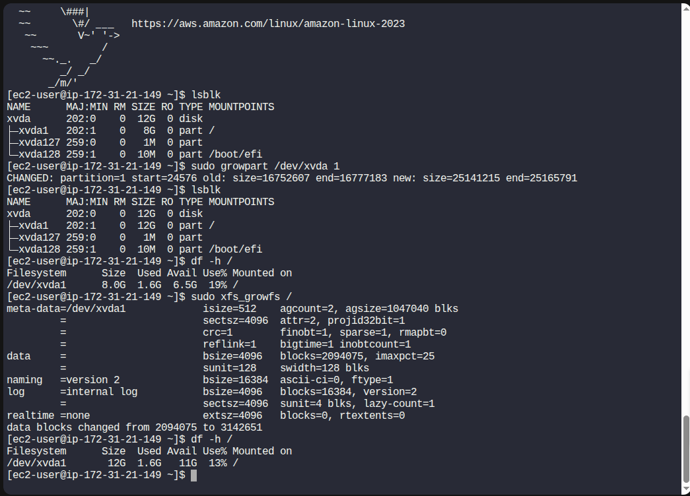

Step 1: Identify the volume attached to xfusion-ec2

From the aws-client host:
```
aws ec2 describe-instances \
  --filters "Name=tag:Name,Values=xfusion-ec2" \
  --query "Reservations[].Instances[].BlockDeviceMappings[].Ebs.VolumeId" \
  --output text
```

✔ This returns a volume ID like:

vol-057ed3f876c222e27

Step 2: Expand the EBS volume (8 GiB → 12 GiB)
```
aws ec2 modify-volume \
  --volume-id vol-057ed3f876c222e27 \
  --size 12
```

Verify modification state
```
aws ec2 describe-volumes-modifications \
  --volume-ids vol-057ed3f876c222e27
```

Wait until:

"Progress": "100"


✅ At this point, AWS has expanded the disk
❌ The OS does NOT see the new space yet

Step 3: SSH into the EC2 instance

From aws-client:
```
ssh -i /root/xfusion-keypair.pem ec2-user@<PUBLIC_IP>
```


Step 4: Verify current disk size (inside EC2)
lsblk


You will see:

NAME      MAJ:MIN RM SIZE RO TYPE MOUNTPOINTS
xvda      202:0    0  12G  0 disk 
├─xvda1   202:1    0   8G  0 part /
├─xvda127 259:0    0   1M  0 part 
└─xvda128 259:1    0  10M  0 part /boot/efi

This is expected.

Step 5: Expand the root partition
Identify root disk

Usually one of these:

/dev/xvda

/dev/nvme0n1


```
# Grow the partition
sudo growpart /dev/xvda 1
# Since this is Amazon Linux, the root filesystem is XFS.
sudo xfs_growfs /
```

Step 7: Verify final result ✅
```
df -h /
```

Expected output:

Filesystem      Size  Used Avail Use%
/dev/xvda1       12G   ...


✔ Root partition now reflects 12 GiB
✔ No reboot required
✔ No downtime


---